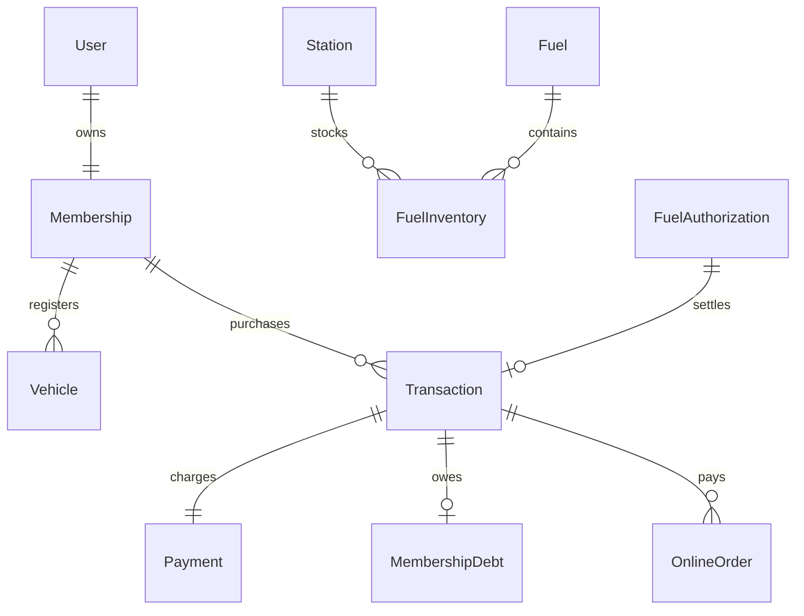

# Relaciones V11

```mermaid
erDiagram
 User ||--|| Membership : owns
 Membership ||--o{ Vehicle : registers
 Membership ||--o{ Transaction : purchases
 Transaction ||--|| Payment : charges
 Transaction ||--o| MembershipDebt : owes
 Transaction ||--o{ OnlineOrder : pays
 Station ||--o{ FuelInventory : stocks
 Fuel ||--o{ FuelInventory : contains
 FuelAuthorization ||--o| Transaction : settles
```
ERD completo heredado: ../docs/DATABASE-ERD.md. OnlineOrder agrega referencias SQL a User/Transaction/Payment.
