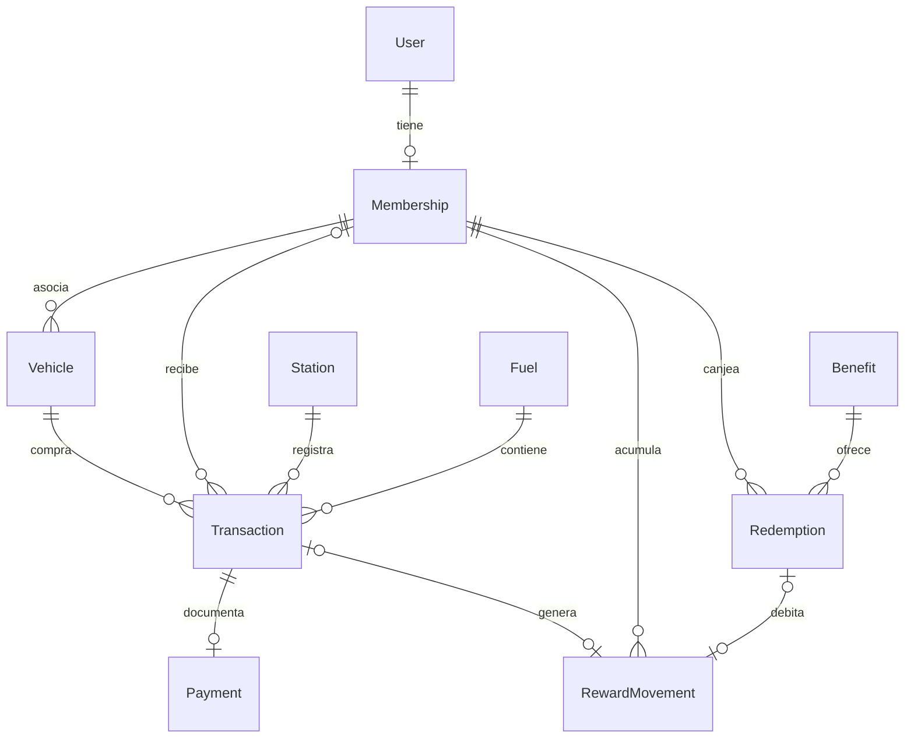
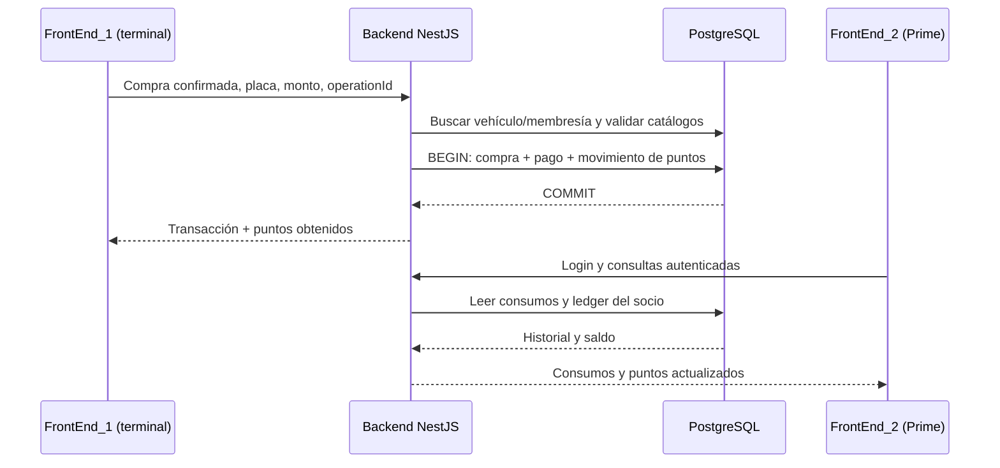

# Primax V6 — backend compartido

Monolito modular REST para el autoservicio `FrontEnd_1` y Primax Prime `FrontEnd_2`.
Los dos frontend permanecen independientes y ya consumen esta API mediante sus proxies. Ver [integración V6](../README.md).

## Inicio desde cero: solo Docker

Ejecutar desde `V6` (PowerShell; en Linux/macOS sustituir `${PWD}` por `$(pwd)`):

```powershell
docker run --rm --mount "type=bind,source=${PWD},target=/workspace" -w /workspace node:22.21.1-bookworm-slim node Backend/scripts/init-env.cjs
docker compose up -d --build
docker compose ps -a
```

El primer comando genera secretos aleatorios en `V6/.env` y `V6/Backend/.env`, ignorados por Git. No sobrescribe archivos existentes. Alternativamente, con Node instalado: `node Backend/scripts/init-env.cjs`.

Compose inicia PostgreSQL, espera su healthcheck, aplica migraciones, ejecuta el seed y arranca NestJS. Los servicios `migrate` y `seed` terminan con código 0; es normal. Los servicios persistentes son `postgres` y `backend`. Después de construir las imágenes basta `docker compose up -d`. Tras cambios de código, usar `--build`.

```powershell
docker compose logs backend migrate seed
docker compose exec backend npm run demo
docker compose --profile test run --build --rm tests
docker compose down
```

`demo` registra **una compra real en la BD local**, verifica login, historial y Swagger e imprime el resultado sin credenciales. Cada ejecución genera una compra diferente. Para reintentar la misma, pasar `-e DEMO_OPERATION_ID=<UUID-v4>` a `docker compose exec` antes de `backend`.

`down` conserva el volumen. No usar `down -v` sobre datos que se quieran conservar. La contraseña de PostgreSQL se establece al inicializar el volumen; cambiar `.env` no cambia automáticamente una contraseña ya creada. Para contraseñas manuales, usar caracteres URL-safe (el generador usa hexadecimal), porque Compose las interpola en `DATABASE_URL`.

## Tecnologías y estructura

| Componente           | Versión fijada  |
| -------------------- | --------------- |
| Node (imagen Docker) | 22.21.1         |
| NestJS               | 11.2.7          |
| TypeScript           | 5.9.3           |
| Prisma CLI / Client  | 6.19.3          |
| PostgreSQL           | 17.6            |
| Swagger para NestJS  | 11.4.7          |
| Jest / ts-jest       | 29.7.0 / 29.4.5 |
| ESLint / Prettier    | 9.39.1 / 3.6.2  |

Las versiones exactas y dependencias transitivas se fijan en `package-lock.json`; las imágenes instalan con `npm ci`. `.dockerignore` excluye `node_modules` del host y archivos `.env`. La imagen final incluye únicamente dependencias de ejecución instaladas dentro de Docker, código compilado y el script demo; corre como usuario `node`.

Se fija `deepmerge-ts@8.0.2` mediante un override limitado a `@prisma/config` para corregir el aviso de agotamiento de pila de su dependencia anterior, y `js-yaml@5.4.3` para Swagger. Las migraciones y pruebas verifican la compatibilidad de esta combinación. El modo desarrollo usa el watch nativo de Node.

```text
Backend/
  src/
    auth/ users/ memberships/ vehicles/ stations/ fuels/
    transactions/ payments/ rewards/ benefits/ health/
    common/ config/ prisma/
    app.module.ts setup-app.ts main.ts
  prisma/schema.prisma
  prisma/migrations/
  prisma/seed.ts
  test/api.e2e-spec.ts
  scripts/init-env.cjs scripts/demo.cjs
  Dockerfile package.json package-lock.json .env.example
../compose.yaml
```

Controllers reciben DTOs y delegan. Services aplican las reglas. Repositories agrupan el acceso a Prisma. `PrismaService` gestiona conexión y transacciones serializables con reintentos acotados. Los modelos de persistencia tipados se generan desde Prisma; `transaction.model.ts` define la proyección del agregado. Los módulos internos `users` y `payments` no necesitan endpoints CRUD públicos. Payment se crea como parte del agregado de compra para garantizar atomicidad. Health consulta Prisma directamente para comprobar conectividad.

Referencias de diseño: [JWT en NestJS 11](https://docs.nestjs.com/v11/techniques/authentication), [Swagger](https://docs.nestjs.com/openapi/introduction), [transacciones y aislamiento de Prisma 6](https://www.prisma.io/docs/orm/v6/prisma-client/queries/transactions).

## Inspección de los frontend y alcance

| Fuente inspeccionada                    | Datos/flujo encontrado                                                                                     | Decisión para esta fase                                                                        |
| --------------------------------------- | ---------------------------------------------------------------------------------------------------------- | ---------------------------------------------------------------------------------------------- |
| `FrontEnd_1/src/js/script.js`           | Regular/Premium/Diésel, galones, prepago/postpago, placa, boleta/factura, tarjeta/efectivo/Yape/Plin/peaje | Compra final confirmada con modalidad, tipo de comprobante, volumen opcional y pago registrado |
| Mismo archivo                           | Padrones `PX-*`, ABC-123 pertenece a María; descuento local del 5% en postpago                             | Seed común solicitado: Diego/PRIME-0001; no importar automáticamente el padrón contradictorio  |
| `FrontEnd_2/js/services/store.js`       | Diego, membresía `PP-*`, dos vehículos, 2450 puntos, saldo monetario, consumos/recargas                    | Membresía con varios vehículos; puntos derivados de movimientos; sin importar saldos ficticios |
| `FrontEnd_2/js/services/index.js`       | Beneficios de 500/400/700 puntos, canjes, perfil y preferencias                                            | Beneficios equivalentes y canjes persistentes; perfil básico en membresía                      |
| `FrontEnd_2/js/services/authService.js` | Login demo local                                                                                           | Login real con hash y JWT                                                                      |
| Docker existente                        | Nginx propio en FrontEnd_1:8081; FrontEnd_2 sirve en 5180                                                  | Compose común nuevo, independiente de los frontend                                             |

Esta API registra compras **ya cobradas**. `amount` es el importe final neto en PEN; no aplica de nuevo descuentos del autoservicio. `unitPrice` guarda el precio de catálogo al comprar; `gallons` conserva el volumen medido si el terminal lo informa. No se deduce el volumen del importe porque puede haber descuentos. El catálogo inicial usa un precio global por combustible.

Los pagos tienen proveedor `DEMO`: no ejecutan cobros de tarjeta, Yape, Plin ni peaje. El tipo de comprobante no equivale a emisión tributaria. Recargas de monedero, procesamiento de pagos pendientes, devoluciones, reglas comerciales de descuentos, documentos tributarios, cambios de perfil y ayuda operativa requieren contratos específicos en fases posteriores. Las simulaciones existentes de los frontend siguen disponibles sin cambios.

## Modelo y reglas

Modelos: `User`, `Membership`, `Vehicle`, `Station`, `Fuel`, `Transaction`, `Payment`, `RewardMovement`, `Benefit`, `Redemption`.



- UUIDs como claves primarias; FKs con eliminación restringida para preservar trazabilidad.
- Email, número de membresía, placa y códigos de catálogo únicos. Índices por membresía/vehículo/estación y fecha para historial.
- Dinero `Decimal`, fechas UTC `timestamptz`; la presentación local corresponde a los frontend.
- Estados enum. La compra de esta fase se crea `PAID`, el pago `CAPTURED` y el canje `ISSUED`; el cliente no puede asignarlos libremente.
- `RewardMovement` es el ledger: `EARN` positivo ligado a compra o `REDEEM` negativo ligado a canje. Restricciones SQL exigen signo y relación correctos, con un movimiento máximo por compra/canje. No existe un saldo mutable aislado.
- Saldo = suma de movimientos de la membresía. Los canjes consultan saldo y crean cupón/débito dentro de la misma transacción `Serializable`; un conflicto reinicia la operación. Así dos canjes concurrentes no pueden gastar el mismo saldo. No se mantiene caché de saldo para esta escala académica.
- `PointsPolicyService` centraliza `floor(amount × POINTS_PER_SOL)`. Tasa inicial **1 sol = 1 punto**. S/100 → 100; S/74.50 → 74; S/0.99 → 0. La fracción no se acumula. Se guardan tasa y puntos históricos en la compra. Cambiar la variable y recrear el backend afecta solo compras nuevas.
- Vehículo inexistente → 404. Prepago sin membresía activa → compra válida con cero puntos y sin movimiento. Postpago requiere membresía y usuario activos, y método `PEAJE`. Prepago usa los otros métodos.
- `operationId` UUID v4 es obligatorio y único por compra/canje. El frontend debe crearlo una vez y conservarlo al reintentar. Misma compra normalizada → misma respuesta con `replayed: true`; cambios de datos → 409. Los reintentos conservan puntos y tasa originales. UUIDs distintos representan compras distintas, aunque tengan el mismo importe.
- La compra, pago y crédito se escriben juntos; el canje y débito también. Tras conflictos persistentes se devuelve 503 para reintentar **con el mismo UUID**.

## API y seguridad

Base: `http://localhost:3000/api/v1`. Swagger: `http://localhost:3000/api/docs`. OpenAPI JSON: `http://localhost:3000/api/docs-json`.

| Método / ruta (bajo `/api/v1`)     | Acceso                                                 |
| ---------------------------------- | ------------------------------------------------------ |
| `GET /health`                      | Público, incluye disponibilidad de PostgreSQL          |
| `POST /auth/login`                 | Público, limitado a 10 intentos/minuto/IP              |
| `GET /memberships/me`              | JWT del socio                                          |
| `GET /memberships/me/transactions` | JWT del socio                                          |
| `GET /memberships/me/rewards`      | JWT del socio                                          |
| `GET /memberships/me/redemptions`  | JWT del socio; ruta adicional para historial de canjes |
| `GET /vehicles`                    | JWT; solo vehículos propios                            |
| `GET /vehicles/:plate`             | JWT del propietario o clave de terminal                |
| `GET /fuels`                       | Público                                                |
| `GET /stations`                    | Público                                                |
| `POST /transactions`               | Clave de terminal `x-kiosk-key`                        |
| `GET /transactions/:id`            | JWT del propietario histórico o clave de terminal      |
| `GET /benefits`                    | Público                                                |
| `POST /rewards/redeem`             | JWT del socio                                          |

Listas privadas: arrays paginados mediante `?page=1&limit=20` (máximo 100); puntos de `/memberships/me` incluyen **todo** el ledger, no solo la página actual. Catálogos devuelven registros activos.

Cuenta demo local: `demo@primaxprime.pe`; contraseña definida con `DEMO_PASSWORD` antes del primer seed. El seed usa bcrypt con coste 12 y no restablece contraseñas ni saldos existentes. No hay registro público.

Login entrega `accessToken`, `tokenType: Bearer`, `expiresIn: 3600` y usuario sin hash. Enviar `Authorization: Bearer <token>` en rutas privadas. JWT HS256 verifica emisor, audiencia, caducidad y usuario activo. Un socio no puede consultar vehículos/compras de otro ni crear compras. No se implementan refresh tokens en esta fase; al caducar se inicia sesión de nuevo.

La clave de terminal se genera en `.env` y permite registrar operaciones demo desde un terminal de confianza. **No debe incrustarse en JavaScript público ni en un APK.** En la integración se necesitará un intermediario de terminal controlado o autenticación de operadores/dispositivos. Swagger permite probar esta credencial localmente mediante Authorize → kiosk.

Helmet, DTOs con `class-validator`, rechazo de campos adicionales, límites de frecuencia y filtro global de errores están activos. CORS permite exactamente los orígenes de `CORS_ORIGINS`; no usa `*` ni credenciales de cookies. CORS no sustituye autenticación. Puertos Docker publicados solo en loopback para este entorno local. El limitador en memoria es suficiente para una instancia; no se confía en cabeceras de proxy arbitrarias.

Ejemplo de compra (reemplazar UUIDs con los de `GET /fuels` y `GET /stations`):

```json
{
  "operationId": "71584691-2bdd-490c-9d7f-b702f3aeb6d8",
  "plate": "ABC-123",
  "stationId": "UUID-DE-PRIMAX-SUR",
  "fuelId": "UUID-DE-PREMIUM",
  "amount": "100.00",
  "mode": "PREPAGO",
  "paymentMethod": "TARJETA",
  "receiptType": "BOLETA"
}
```

Respuesta: `{ "transaction": { "id": "...", "amount": "100.00", "membership": { "number": "PRIME-0001", "name": "Diego" }, "...": "..." }, "pointsEarned": 100, "replayed": false }`.

Canje: `POST /rewards/redeem` con `{ "benefitId": "UUID", "operationId": "UUID-v4" }`. Devuelve `{ redemption, replayed }`; el UUID de `redemption.id` identifica el cupón. Puntos insuficientes → 400; beneficio inactivo → 404.

Errores consistentes: `{ statusCode, message, path, timestamp }`. `message` puede ser una lista en errores de validación. No se devuelven stacks, SQL ni credenciales. Las placas `ABC123`/`abc-123` se normalizan a `ABC-123`; se admiten caracteres alfanuméricos en el bloque inicial, como `D4X-207` del frontend.

## Desarrollo local opcional

Node 22 o 24 y Docker. En PowerShell con restricciones de scripts utilizar `npm.cmd`/`npx.cmd` en lugar de `npm`/`npx`.

```powershell
# Desde V6
node Backend/scripts/init-env.cjs
docker compose up -d postgres
cd Backend
npm ci
npm run prisma:generate
npm run prisma:migrate
npm run prisma:seed
npm run start:dev
```

Si el backend Docker ocupa el puerto 3000, detener solo ese servicio con `docker compose stop backend` desde V6, o configurar otro `PORT` en `Backend/.env`.

```powershell
npm run build
npm start
npm test
npm run test:e2e
npm run lint
npm run format:check
npm run prisma:studio
```

`prisma:migrate` aplica migraciones versionadas (`migrate deploy`). Para cambiar el modelo en desarrollo: `npm run prisma:migrate:dev -- --name nombre_del_cambio`, revisar SQL y regenerar cliente. No usar `db push` en lugar del historial. Los constraints manuales se conservan en la segunda migración. Prisma 6 avisa que `package.json#prisma` quedará obsoleto en Prisma 7; la configuración actual pertenece a la versión fijada.

El seed es idempotente: upserts por claves naturales con actualizaciones vacías. Crea Diego/PRIME-0001, ABC-123 y DEF-456, XYZ-999 sin membresía, Primax Sur, tres combustibles y tres beneficios. No crea compras ni créditos ficticios y no borra información existente.

Variables: `DATABASE_URL`, `JWT_SECRET` (32+ caracteres), `KIOSK_API_KEY` (32+), `PORT`, `POINTS_PER_SOL` (>0, <=100, hasta cuatro decimales), `CORS_ORIGINS`, `DEMO_PASSWORD`. Compose añade `POSTGRES_DB`, `POSTGRES_USER`, `POSTGRES_PASSWORD`, `POSTGRES_PORT` y admite `KIOSK_SECRET` como nombre preferido de la clave kiosk. Archivos `.env.example` contienen marcadores, nunca secretos reales.

## Pruebas

Las unitarias verifican autenticación correcta/incorrecta/inactiva, búsqueda y autorización de vehículos, cálculo exacto, validación, creación de compra/pago/ledger, membresía ausente/suspendida, duplicados y canjes.

Las e2e ejecutan NestJS y Prisma reales contra PostgreSQL; crean un esquema `e2e_<uuid>`, aplican todas las migraciones y el seed, y permiten conservar el esquema usando KEEP_E2E_SCHEMA=1 (el perfil Docker lo configura). Sin esa variable, eliminan únicamente su propio esquema al terminar. No se trunca el esquema `public`. El usuario de pruebas necesita permisos para crear/eliminar esquemas; no ejecutar con credenciales de producción. Una interrupción abrupta puede dejar un esquema `e2e_*`, que debe identificarse antes de retirarlo.

Se verifica HTTP, Swagger, JWT, aislamiento entre usuarios, DTOs, atomicidad mediante un fallo real de constraint, CORS, idempotencia concurrente y canjes concurrentes. Los mensajes de error de la prueba de rollback son intencionales; el resultado de Jest determina éxito o fallo.

## DBeaver

Crear conexión **PostgreSQL**, con los valores predeterminados generados:

| Parámetro | Valor                                     |
| --------- | ----------------------------------------- |
| Host      | `localhost`                               |
| Puerto    | `5433` (`POSTGRES_PORT`)                  |
| Database  | `primax_v6` (`POSTGRES_DB`)               |
| Username  | `primax` (`POSTGRES_USER`)                |
| Password  | Valor de `POSTGRES_PASSWORD` en `V6/.env` |
| Schema    | `public`                                  |
| SSL local | Desactivado                               |

Dentro de Compose el host es `postgres` y el puerto `5432`; DBeaver usa el puerto del host `5433`. Permitir que DBeaver descargue el driver PostgreSQL y usar «Test Connection».

**DBeaver** es una herramienta administrativa externa. **Prisma** es la capa de acceso usada por NestJS. **PostgreSQL** es la base de datos real. La aplicación funciona sin DBeaver.

## Flujo integrado



Los adaptadores HTTP, proxies y prueba de navegador están implementados. Ver ../README.md para ejecutar la integración.
